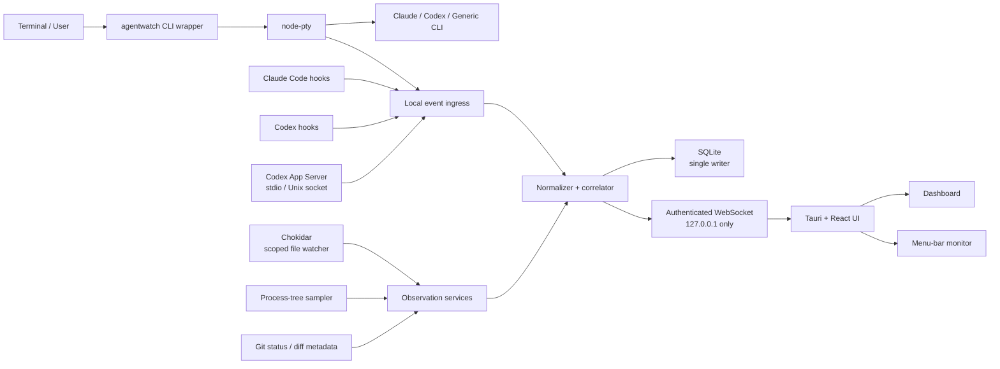
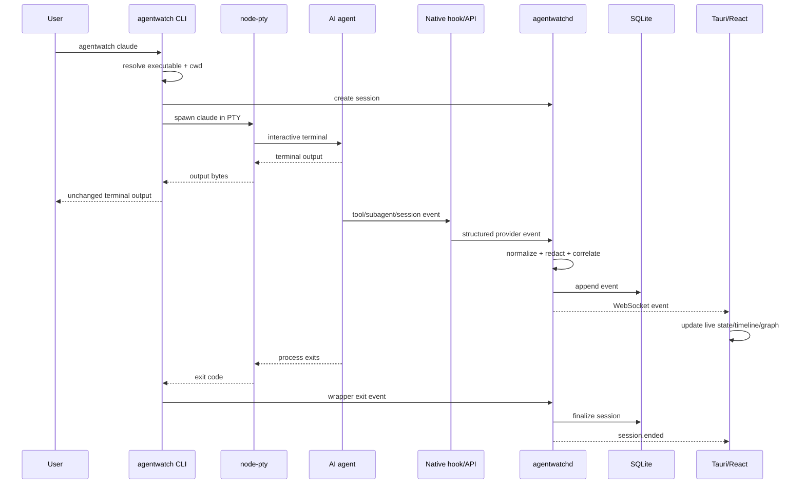

# AgentWatch: Mac-Only Local AI Agent Monitor — Implementation Plan

## Executive summary

**AgentWatch is technically feasible as a Mac-only Tauri + React desktop application, and the strongest implementation is not a PTY-only monitor.** The recommended architecture is a **native-telemetry-first, observation-second** system: use Claude Code and Codex’s structured integration surfaces whenever they exist, then supplement them with a PTY wrapper, scoped filesystem watching, Git snapshots, and process-tree observation for generic agents and gaps in provider telemetry.

That distinction matters because both first-party agents now expose substantially richer structured signals than a terminal parser can reliably reconstruct. Claude Code hooks expose session lifecycle, tool execution, permission requests, subagent lifecycle, file changes, model switching, tasks, errors, and other events; subagent tool events include agent identifiers. citeturn16view0turn17view2 Codex now has hooks with session/tool/subagent events and an App Server that emits structured `thread/*`, `turn/*`, and `item/*` events, unified turn diffs, approval requests, and token-usage updates. citeturn15view0turn15view1turn15view2turn15view4

The recommended information hierarchy is therefore:

```text
Highest fidelity
     │
     ▼
Native Claude/Codex hooks + structured APIs
     │
     ▼
PTY wrapper / process lifecycle
     │
     ▼
Filesystem watcher + Git state
     │
     ▼
Process-tree sampling
     │
     ▼
Terminal-text heuristics
Lowest fidelity
```

For **Claude Code**, AgentWatch should primarily consume hooks. For **Codex**, use App Server when AgentWatch owns the launch, and Codex hooks when observing ordinary Codex CLI sessions. For a **generic CLI agent**, require `agentwatch run -- <agent>` for full monitoring and accept that events such as “subagent started,” “tool call,” or token counts usually cannot be known reliably without an agent-specific adapter.

I recommend the following product boundaries:

**Target:** macOS 12 Monterey or later, Apple Silicon and Intel, local-only, Developer ID distribution outside the Mac App Store.

**Frontend:** Tauri 2.12.x + React 19.3 + Vite 7.x. Tauri’s current JS API is in the 2.12 line, while React reports v19.3 and Vite currently exposes Vite 7 as its stable documentation line. citeturn21search16turn21search23turn19search1turn22search0

**Monitoring runtime:** Node.js 24 LTS, not Bun for the MVP. Node 24 is currently LTS, whereas Node 26 remains Current as of October 2026. citeturn21search2 Bun 1.4.2 is current, but Bun’s own installation documentation requires macOS 13 or later, which conflicts with the proposed macOS 12+ floor. citeturn22search1turn22search15

**Storage:** SQLite owned exclusively by the daemon, with WAL enabled. SQLite documents WAL as a persistent journal mode; using a single daemon writer also avoids making the React/Tauri side responsible for database concurrency. citeturn9search0

**Distribution:** `.dmg` should be the normal installer. Tauri directly supports DMG production; an optional `.pkg` can be generated as a post-build step with Apple’s `productbuild` and signed using a Developer ID Installer identity. citeturn1search9turn22search13

**Privacy:** AgentWatch itself should make no network requests during normal monitoring, send no telemetry, store no prompt text by default, store no complete PTY transcript by default, and store only Git/file metadata rather than full file contents or patches unless the user explicitly opts in. This does **not** mean the monitored Claude or Codex process is offline; only AgentWatch’s collection and UI pipeline are local.

A production-quality MVP is realistically **about 216–284 engineering hours**, or roughly **six to eight full-time engineer-weeks**, assuming one engineer already comfortable with TypeScript, React, Tauri/Rust basics, macOS signing, and CLI tooling. The uncertainty is concentrated in interactive PTY correctness, provider-version drift, background-daemon packaging, and macOS release/signing work rather than in the dashboard itself.

## Goals, scope, and MVP

The product should answer one question well:

> **What are the AI agents on this Mac doing right now, what did they just do, and what changed as a result?**

The primary UX should resemble the supplied screenshot's dense developer-tool aesthetic, but the underlying product should be easier to scan: a dashboard for investigation plus a menu-bar surface for glanceable state.

The assumed support floor is **macOS 12+**. Tauri permits configuration of the app bundle’s minimum macOS system version, so `12.0` should be set explicitly rather than relying on Tauri’s broader default compatibility range. citeturn1search16

AgentWatch should remain **single-user and local-only** in the MVP. There is no account system, cloud synchronization, team dashboard, remote execution, browser dashboard, or server deployment. The daemon, database, Tauri application, hook receivers, and wrappers all run under the logged-in user.

**Privacy is a functional requirement rather than merely a preference.** Provider hooks can expose sensitive content: for example, Claude Code's `UserPromptSubmit` event contains the submitted prompt, while Codex's corresponding hook also exposes the prompt. citeturn17view1turn15view5 AgentWatch therefore should not subscribe to or persist prompt-bearing fields merely because they are available.

### MVP feature priorities

| Feature | Priority | Estimated effort | MVP definition |
|---|---:|---:|---|
| Overview / running sessions | P0 | 12–16 h | Active agents, provider, model when known, cwd/repo, elapsed time, current state |
| Live activity | P0 | 12–16 h | “Reading”, “Editing”, “Running tests”, “Waiting for approval”, “Idle”, “Finished” |
| Session timeline | P0 | 14–20 h | Ordered normalized event feed with source and confidence |
| File activity | P0 | 16–22 h | Reads when provider reports them; observed writes/deletes; Git additions/deletions |
| Command activity | P0 | 18–24 h | Command start/end, exit status, duration, associated agent when known |
| Logs | P0 | 10–14 h | Structured event log and sanitized diagnostic log |
| Agent graph | P0 | 16–24 h | Main agent → subagent hierarchy where provider exposes relationships |
| Menu-bar mini monitor | P0 | 16–22 h | Running count, current actions, approval/error badge, open-dashboard action |
| Local persistence / history | P0 | 14–20 h | Recent sessions retained locally with deletion controls |
| Token usage | P1 | 8–16 h | Show only when supplied by a stable structured provider interface |
| Raw terminal replay | P2 | 20–30 h | Explicit opt-in only; not required to ship MVP |
| Full diff/prompt archive | P2 | 16–24 h | Explicit opt-in only; intentionally excluded from privacy-first defaults |

“File activity” must distinguish **provider-reported action** from **filesystem-observed change**. Seeing a file change through Chokidar proves that the file changed; it does not prove which agent changed it if multiple agents, editors, build tools, or the user are touching the same repository. Claude Code’s own hook data acknowledges a related concurrency problem by marking some diffs as shared when another Bash tool call operates in the same repository. citeturn16view0

The UI should therefore expose provenance implicitly or explicitly:

```text
HIGH     provider hook says Claude edited src/auth.ts
HIGH     Codex item reports a fileChange
MEDIUM   child process belonging to session executed pnpm test
LOWER    filesystem watcher saw src/auth.ts change during session
LOWER    Git diff changed while two sessions shared the same repo
```

This is a key product decision. AgentWatch should **show what is known rather than invent agent intent**.

## System architecture and data design

The cleanest architecture separates collection from presentation. The React interface should never parse terminal output, watch files, run Git commands, or open SQLite itself. Those responsibilities belong to a background service that normalizes every provider into one versioned event model.

Tauri supports embedding external binaries as sidecars and requires architecture-specific external binaries to use the appropriate target triple, which is useful for a Node runtime/helper and native `node-pty` dependency. citeturn1search23 Because both the Node binary and `node-pty` contain architecture-specific native code, the lowest-risk MVP release strategy is **separate arm64 and x86_64 builds**, followed by a Universal 2 packaging investigation later.



**Daemon.** `agentwatchd` owns session state, adapter lifecycles, event normalization, correlation, persistence, retention, redaction, the local WebSocket server, and background observation. It is the only process that writes SQLite. This makes data ordering and migrations much easier to reason about.

**Adapter layer.** Each adapter converts provider-specific events into a common model:

```text
Claude hook JSON     ─┐
Codex JSON-RPC       ─┼─> Adapter ─> AgentEvent v1
PTY/process events   ─┤
Chokidar/Git events  ─┘
```

**Observation layer.** Chokidar v6 uses Node's filesystem-watch primitives while normalizing common add/change/unlink behavior and handling patterns such as atomic and chunked writes. Its own documentation recommends limiting the watched scope rather than watching unnecessarily broad directory trees. citeturn6view1turn7view1 AgentWatch should therefore watch only active session roots and ignore at least `.git`, `node_modules`, dependency caches, build outputs, and AgentWatch's own storage directory.

**PTY layer.** `node-pty` 1.1.0 provides `forkpty`-style pseudoterminal bindings on macOS and exposes terminal reads/writes and resize behavior. Its documentation also warns that spawned children run with the same permissions as the parent and that `node-pty` itself is not thread-safe. citeturn6view0turn7view0 This makes it suitable for an interactive wrapper, but not a security boundary.

**Process layer.** `ps-tree` can obtain descendant processes on Unix by spawning and parsing `ps`, but its current package is 1.2.0 and was last published eight years ago. citeturn22search20 I would use it in the first prototype only. For the released Mac-only application, a small macOS-specific process sampler—either a controlled `ps` parser or a Rust implementation—would reduce dependence on an old package. Process sampling should remain supplementary because polling can miss very short-lived children.

**Git layer.** Git should be treated as state inspection, not attribution. At session start, record baseline status; after observed writes, debounce and query status plus `--numstat` for affected files; at session end, capture final summary. Full unified patches should be generated only when the user opens a diff or enables diff persistence.

### Normalized event contract

Every event should explicitly carry provenance and confidence:

```ts
export type AgentProvider =
  | "claude-code"
  | "codex"
  | "generic";

export type EventSource =
  | "claude-hook"
  | "codex-hook"
  | "codex-app-server"
  | "pty"
  | "filesystem"
  | "git"
  | "process";

export type Confidence = "high" | "medium" | "low";

export interface AgentEvent<TPayload = unknown> {
  schemaVersion: 1;

  id: string;
  sequence: number;

  sessionId: string;
  agentId: string;
  parentAgentId?: string;

  provider: AgentProvider;
  kind:
    | "session.started"
    | "session.ended"
    | "agent.started"
    | "agent.ended"
    | "status.changed"
    | "tool.started"
    | "tool.completed"
    | "tool.failed"
    | "file.read"
    | "file.write"
    | "file.delete"
    | "command.started"
    | "command.output"
    | "command.completed"
    | "approval.requested"
    | "approval.resolved"
    | "usage.updated"
    | "git.changed"
    | "log";

  occurredAt: string;       // UTC RFC3339
  receivedAt: string;
  cwd?: string;

  correlationId?: string;
  source: EventSource;
  confidence: Confidence;
  redacted: boolean;

  payload: TPayload;
}
```

A monotonically increasing daemon-side `sequence` is preferable to sorting solely by wall-clock timestamps. Provider timestamps, filesystem events, and subprocess events can arrive slightly out of order; the sequence becomes the canonical replay order while `occurredAt` remains useful for display.

A representative command payload:

```ts
interface CommandStartedPayload {
  commandId: string;
  executable?: string;
  argvDisplay: string;   // sanitized display string
  pid?: number;
  ppid?: number;
}

interface CommandCompletedPayload {
  commandId: string;
  exitCode: number | null;
  signal?: string;
  durationMs: number;
}
```

A usage event should not assume every provider exposes the same accounting model:

```ts
interface UsagePayload {
  model?: string;

  inputTokens?: number;
  outputTokens?: number;
  cachedInputTokens?: number;
  reasoningTokens?: number;

  providerReported: boolean;
  scope: "turn" | "thread" | "session" | "account";
}
```

Codex App Server explicitly exposes `thread/tokenUsage/updated`; it also has an account-level usage request, although thread-level events are more appropriate for AgentWatch session monitoring. citeturn15view2turn14view2 Token values should never be estimated from terminal text and labeled as provider usage.

### SQLite model

SQLite WAL mode is appropriate here because the daemon can append events continuously while the UI requests historical snapshots, but the implementation should still retain a **single application writer** rather than relying on multi-process write behavior. citeturn9search0

The schema can stay relational for the fields AgentWatch queries constantly while retaining raw normalized payloads as JSON text:

```sql
PRAGMA foreign_keys = ON;
PRAGMA journal_mode = WAL;
PRAGMA synchronous = NORMAL;

CREATE TABLE sessions (
    id                TEXT PRIMARY KEY,
    provider          TEXT NOT NULL,
    provider_session_id TEXT,
    adapter_version   TEXT NOT NULL,
    executable        TEXT,
    model             TEXT,
    cwd               TEXT,
    repo_root         TEXT,
    status            TEXT NOT NULL,
    started_at        TEXT NOT NULL,
    ended_at          TEXT,
    exit_code         INTEGER,
    privacy_mode      TEXT NOT NULL,
    metadata_json     TEXT NOT NULL DEFAULT '{}'
);

CREATE TABLE agents (
    id                TEXT PRIMARY KEY,
    session_id        TEXT NOT NULL REFERENCES sessions(id) ON DELETE CASCADE,
    parent_agent_id   TEXT REFERENCES agents(id) ON DELETE SET NULL,
    provider_agent_id TEXT,
    role              TEXT,
    display_name      TEXT,
    model             TEXT,
    status            TEXT NOT NULL,
    started_at        TEXT NOT NULL,
    ended_at          TEXT
);

CREATE TABLE events (
    id                TEXT PRIMARY KEY,
    session_id        TEXT NOT NULL REFERENCES sessions(id) ON DELETE CASCADE,
    agent_id          TEXT REFERENCES agents(id) ON DELETE SET NULL,
    sequence          INTEGER NOT NULL,
    occurred_at       TEXT NOT NULL,
    received_at       TEXT NOT NULL,
    kind              TEXT NOT NULL,
    source            TEXT NOT NULL,
    confidence        TEXT NOT NULL,
    correlation_id    TEXT,
    redacted          INTEGER NOT NULL DEFAULT 0,
    payload_json      TEXT NOT NULL
);

CREATE UNIQUE INDEX idx_events_session_sequence
    ON events(session_id, sequence);

CREATE INDEX idx_events_kind_time
    ON events(kind, occurred_at);

CREATE TABLE commands (
    id                TEXT PRIMARY KEY,
    session_id        TEXT NOT NULL REFERENCES sessions(id) ON DELETE CASCADE,
    agent_id          TEXT REFERENCES agents(id) ON DELETE SET NULL,
    provider_tool_id  TEXT,
    pid               INTEGER,
    ppid              INTEGER,
    argv_display      TEXT NOT NULL,
    cwd               TEXT,
    started_at        TEXT NOT NULL,
    ended_at          TEXT,
    exit_code         INTEGER,
    signal            TEXT,
    source            TEXT NOT NULL,
    confidence        TEXT NOT NULL
);

CREATE TABLE file_activity (
    id                TEXT PRIMARY KEY,
    session_id        TEXT NOT NULL REFERENCES sessions(id) ON DELETE CASCADE,
    agent_id          TEXT REFERENCES agents(id) ON DELETE SET NULL,
    path              TEXT NOT NULL,
    operation         TEXT NOT NULL,
    occurred_at       TEXT NOT NULL,
    additions         INTEGER,
    deletions         INTEGER,
    source            TEXT NOT NULL,
    confidence        TEXT NOT NULL
);

CREATE INDEX idx_file_activity_session_path
    ON file_activity(session_id, path);

CREATE TABLE usage_samples (
    id                  TEXT PRIMARY KEY,
    session_id          TEXT NOT NULL REFERENCES sessions(id) ON DELETE CASCADE,
    agent_id            TEXT REFERENCES agents(id) ON DELETE SET NULL,
    occurred_at         TEXT NOT NULL,
    model               TEXT,
    scope               TEXT NOT NULL,
    input_tokens        INTEGER,
    output_tokens       INTEGER,
    cached_input_tokens INTEGER,
    reasoning_tokens    INTEGER,
    source              TEXT NOT NULL
);

CREATE TABLE requests (
    id                  TEXT PRIMARY KEY,
    session_id          TEXT NOT NULL REFERENCES sessions(id) ON DELETE CASCADE,
    agent_id            TEXT REFERENCES agents(id) ON DELETE SET NULL,
    provider_request_id TEXT,
    kind                TEXT NOT NULL,
    status              TEXT NOT NULL,
    summary             TEXT,
    created_at          TEXT NOT NULL,
    resolved_at         TEXT,
    source              TEXT NOT NULL
);
```

The `requests` table gives the menu-bar monitor a straightforward way to answer “does anything need me?” without rescanning arbitrary event payloads.

### Local API

Use two local transports:

```text
Provider hooks / helper CLI
        │
        ├── Unix-domain/local ingestion channel
        │
        ▼
    agentwatchd
        │
        └── WebSocket on 127.0.0.1
                    │
                    ▼
               Tauri UI
```

The WebSocket protocol can be intentionally small:

```json
// UI -> daemon
{
  "type": "hello",
  "protocol": 1,
  "token": "<ephemeral-capability>"
}
```

```json
// UI -> daemon
{
  "type": "subscribe",
  "sessionIds": ["*"]
}
```

```json
// daemon -> UI
{
  "type": "event",
  "event": {
    "schemaVersion": 1,
    "sequence": 481,
    "kind": "command.completed"
  }
}
```

```json
// daemon -> UI
{
  "type": "snapshot",
  "sessions": [],
  "agents": [],
  "pendingRequests": []
}
```

The daemon should send **no session data before authentication**. A browser WebSocket client cannot conveniently set an arbitrary `Authorization` header, so the Tauri backend should obtain the daemon secret and give the frontend a short-lived capability; the first WebSocket frame then authenticates the stream. Do not put a long-lived secret in the WebSocket URL.

### Wrapper-to-UI sequence



## Agent adapters and CLI capture strategy

The adapter system should be designed around **capabilities, not provider names**. A provider adapter declares which signals are authoritative, which are partial, and which must be augmented by observation.

### Adapter capability comparison

| Capability | Claude Code adapter | Codex adapter | Generic CLI adapter |
|---|---|---|---|
| Session lifecycle | **High** — hooks include session events citeturn16view0 | **High** — hooks / App Server thread-turn lifecycle citeturn14view4turn15view1 | **High only when wrapped** |
| Tool calls | **High** — `PreToolUse`, `PostToolUse`, failure events citeturn16view0turn16view0 | **High** — hooks and structured `item/*` lifecycle citeturn15view0turn15view5 | Low / heuristic |
| File reads | High when tool event identifies read | Provider-dependent structured item/hook | Usually unavailable |
| File writes | **High** via tool events; `FileChanged` also exists citeturn16view0turn17view0 | **High** — `fileChange` items and turn diff citeturn15view0turn15view1 | Medium via filesystem observation |
| Commands | **High** for Bash/tool activity | **High** for command execution items citeturn15view0 | Medium through descendants/output |
| Subagents | **High** — IDs and types supplied citeturn17view2 | **High** — hooks supply `agent_id` and `agent_type` citeturn15view4 | Usually unknown |
| Approval needed | `PermissionRequest` hook citeturn16view0 | Structured approval requests in App Server citeturn15view0 | No reliable generic contract |
| Git diff | Supplementary local Git | App Server emits aggregated turn diff citeturn15view1 | Supplementary local Git |
| Token usage | Partial / only where stable provider data exists | **High with App Server** `thread/tokenUsage/updated` citeturn15view2 | Normally unavailable |
| Works without AgentWatch wrapper | **Yes**, after hooks are explicitly enabled | **Yes via hooks**; App Server requires AgentWatch-controlled mode | No, not with full fidelity |
| Overall fidelity | Highest | Highest | Moderate |

### Claude Code

Claude should use an **opt-in hook integration** as the authoritative source rather than terminal parsing. Claude currently exposes `PreToolUse`, `PermissionRequest`, `PostToolUse`, tool failures, notifications, subagent lifecycle, tasks, file-change events, model-switch events, session termination, and other lifecycle hooks. citeturn16view0 Subagent calls to tools go through the same tool hooks and include the subagent's `agent_id` and `agent_type`, which directly supports the requested Agent Graph. citeturn16view0turn17view2

AgentWatch should **not parse Claude transcript files as a primary contract**. The equivalent Codex documentation explicitly calls its transcript format unstable, and in general a provider-controlled log format is weaker than a documented hook/event API. citeturn15view4 For Claude, transcript paths may be recorded as diagnostics metadata but reading transcript content should remain an optional fallback.

Useful mappings are straightforward:

```text
Claude event                 AgentWatch event

SessionStart              -> session.started
PreToolUse(Read)          -> file.read / tool.started
PreToolUse(Bash)          -> command.started
PostToolUse               -> tool.completed
PostToolUseFailure        -> tool.failed
PermissionRequest         -> approval.requested
SubagentStart             -> agent.started
SubagentStop              -> agent.ended
FileChanged               -> file.write/delete observation
PostModelSwitch           -> status/model update
SessionEnd                -> session.ended
```

Claude's hook API can include prompt content and latest assistant messages in some events. citeturn17view0turn17view1 The adapter should explicitly discard those fields unless the user enables “Store conversation content.”

### Codex CLI

Codex offers two unusually useful integration paths.

For sessions **launched under AgentWatch control**, App Server is the superior interface. Its default transport is newline-delimited JSON over stdio; it also supports a Unix-socket transport. Its TCP WebSocket transport is documented as experimental and unsupported, so AgentWatch should not make that transport foundational. citeturn14view0turn14view1

App Server streams structured events such as `item/started`, `item/completed`, tool progress and agent messages. citeturn15view0turn15view3 It exposes turn completion, aggregated unified diffs, approval requests for command execution and file changes, and token-usage updates. citeturn15view1turn15view2turn15view0 That makes it possible to build a much richer Codex adapter without reverse-engineering terminal output.

For Codex sessions started normally outside AgentWatch, **Codex hooks** can provide lifecycle/tool/subagent signals. Current Codex hooks include session events, pre/post tool events, permission requests, subagent start/stop, prompt submission, stop and interruption signals; subagent events supply agent identifiers and types. citeturn15view4turn15view5

The App Server should therefore not replace the hook adapter. Both are useful:

```text
agentwatch codex
      │
      └─> Codex App Server adapter  ← richest path

plain `codex`
      │
      └─> Codex hook adapter        ← observation path
```

Codex non-interactive mode additionally has `codex exec --json`, where stdout becomes JSONL containing events such as `thread.started`, `turn.started`, `turn.completed`, `item.*`, and errors. citeturn14view6 This is useful for tests and automation but should not be treated as the main interface for interactive CLI sessions.

### Generic CLI

The generic adapter should make fewer promises:

```bash
agentwatch run -- my-agent
```

or convenience aliases:

```bash
agentwatch claude
agentwatch codex
agentwatch run -- custom-agent --project .
```

The wrapper must behave like a transparent terminal host:

```text
real stdin
   ↓
AgentWatch wrapper
   ↓
node-pty
   ↓
real agent process
   ↓
stdout/PTY bytes
   ↓
AgentWatch wrapper
   ↓
real terminal
```

It should preserve the terminal's `TERM`, dimensions, working directory and relevant environment; update the PTY on terminal resize; preserve the child's exit code; handle `SIGHUP`/termination cleanly; and avoid altering ANSI sequences sent to the user's terminal. `node-pty` provides the PTY read/write and resize primitives necessary for this on macOS. citeturn6view0

The PTY byte stream should be used primarily for:

```text
session alive/dead
terminal title/status heuristics
error snippets
generic log viewing
```

It should **not** be the authoritative parser for:

```text
"this exact file was read"
"this subprocess is a subagent"
"these are the model's tokens"
"the model is currently reasoning about X"
```

Chokidar and the process sampler supplement generic sessions. A filesystem change becomes:

```ts
{
  kind: "file.write",
  source: "filesystem",
  confidence: "low",
  payload: {
    path: "/repo/src/auth.ts"
  }
}
```

while a provider hook could represent the same file operation as:

```ts
{
  kind: "file.write",
  source: "claude-hook",
  confidence: "high",
  payload: {
    path: "/repo/src/auth.ts",
    toolUseId: "toolu_..."
  }
}
```

The normalizer can de-duplicate these within a short correlation window while preserving both provenance records internally.

## macOS packaging, permissions, security, and privacy

A Mac-only product permits AgentWatch to be significantly more deliberate than a cross-platform desktop monitor.

### Background service model

Apple's `launchd` model distinguishes per-user LaunchAgents from system LaunchDaemons; user agents can live under the user's `~/Library/LaunchAgents`, whereas system daemons live under `/Library/LaunchDaemons`. citeturn4view1 A `launchd`-managed process should stay in the foreground rather than daemonizing itself, and should cooperate with normal termination signals. citeturn4view2

AgentWatch should use a **user LaunchAgent, never a root LaunchDaemon**, and enable it only after an explicit “Start AgentWatch in background/login” action.

Recommended lifecycle:

```text
Install AgentWatch.app
        │
        ▼
First launch
        │
        ├─ Create ~/Library/Application Support/AgentWatch/
        ├─ Initialize DB
        ├─ Generate local capability secret
        │
        └─ Ask:
             [ ] Start monitoring at login
             [ ] Install AgentWatch CLI
             [ ] Enable Claude integration
             [ ] Enable Codex integration
```

A privacy-oriented default is to keep login startup **off** until the user enables it. Once enabled, the LaunchAgent starts `agentwatchd` for that user.

The daemon should not fork into a second background process; `launchd` should own its lifecycle, consistent with Apple's service-management guidance. citeturn4view2

### Application packaging

Tauri can build a macOS `.app` and directly produce a DMG with:

```bash
pnpm tauri build --bundles dmg
```

Tauri documents DMG as the common installer format for distributing macOS applications outside the App Store. citeturn1search9

The normal release artifacts should therefore be:

```text
AgentWatch_0.x.y_aarch64.dmg
AgentWatch_0.x.y_x64.dmg
```

A `.pkg` is useful later for managed or scripted installation:

```text
AgentWatch_0.x.y_aarch64.pkg
AgentWatch_0.x.y_x64.pkg
```

Apple recommends a **Developer ID Installer** identity for independently distributed installer packages and documents `productbuild` for creating a package containing a single app. citeturn22search13 That makes `.pkg` a post-Tauri packaging step rather than the primary Tauri artifact.

### Signing and notarization

A downloaded Mac application needs a proper Developer ID release pipeline. Tauri's macOS signing documentation notes that signing is required for App Store distribution and is also needed to avoid the damaged/unverified experience for independently downloaded apps; notarization requires an Apple Developer account. citeturn4view0 Apple describes notarization as the process by which Apple examines Developer ID-signed software before distribution. citeturn2search1

Release order should be:

```text
Build app + helpers
      ↓
Code-sign nested binaries/native addons
      ↓
Code-sign AgentWatch.app
      ↓
Build DMG
      ↓
Submit for Apple notarization
      ↓
Staple notarization ticket
      ↓
Verify Gatekeeper acceptance
      ↓
Publish
```

For a `.pkg`, use the separate Developer ID Installer identity Apple specifies. citeturn22search13

All embedded helpers—including the appropriate Node runtime and `node-pty` native addon—must be part of the signed/notarized artifact. Tauri supports external sidecar binaries with architecture-specific names, which is useful for producing separate Intel and Apple Silicon releases. citeturn1search23

### Menu-bar integration

Tauri 2 provides system-tray APIs in both Rust and JavaScript and supports menus and tray events. citeturn3view0 On macOS this maps naturally to a menu-bar item.

A conventional tray menu is too constrained for the screenshot-inspired mini monitor, so the better interaction is:

```text
[AgentWatch status icon]
          │ click
          ▼
small borderless Tauri window
positioned beneath menu-bar item
```

The window can show live React content, while right-clicking or a settings action can still use a native tray menu.

### Permissions policy

AgentWatch should **not** require Accessibility, Screen Recording, or Full Disk Access for its core MVP. Instead, it should observe agents that are explicitly integrated or launched through AgentWatch and restrict filesystem watchers to their working directories.

This architecture intentionally avoids trying to become a universal system surveillance tool. A generic session AgentWatch did not wrap and for which no provider hook exists may be detected as a process, but it should not be advertised as fully observable.

I would also avoid the Mac App Sandbox for this Developer ID build. The app's purpose involves arbitrary developer workspaces, child processes, PTYs, CLI helpers, Git repositories, and local agent integrations; treating AgentWatch as an unrestricted Developer ID utility while applying application-level least privilege is materially simpler. Tauri does support custom macOS entitlement configuration where signing-specific entitlements are needed. citeturn1search16

### Privacy defaults

The default storage policy should be:

| Data | Default |
|---|---|
| Session identity/timestamps | Store |
| Model/provider name | Store when supplied |
| Tool names | Store |
| File paths | Store |
| Git `+/-` statistics | Store |
| Command display string | Store after redaction |
| Exit codes/errors | Store |
| Token counts | Store when provider-reported |
| User prompt text | **Do not store** |
| Assistant response text | **Do not store** |
| Environment variables | **Do not store** |
| Raw PTY transcript | **Do not persist** |
| File contents | **Do not store** |
| Full Git patch | **Do not persist by default** |
| API keys/tokens | **Never store in event DB** |

The reason for these defaults is concrete: both Claude and Codex integration surfaces can expose conversation text and tool inputs, and command lines themselves can contain credentials. citeturn17view1turn15view5 “Local-only” is not sufficient protection if a monitoring database quietly becomes a second copy of every secret seen during development.

Additional controls should include:

**Loopback only.** The UI WebSocket listens only on `127.0.0.1`; no `0.0.0.0`, LAN discovery, or remote dashboard.

**Authenticated local stream.** A random per-install daemon secret is stored with user-only filesystem permissions. The frontend gets only a short-lived capability through the Tauri backend.

**No raw environment capture.** The wrapper should construct a child environment but never dump `process.env` into logs.

**Redaction before persistence.** Apply patterns for common credential syntax to command display strings and errors before inserting them into SQLite.

**No shell interpolation for internal Git commands.** Use argument arrays such as `spawn("git", ["diff", "--numstat", "--", path])`; paths are data, not shell text.

**Scoped watcher roots.** Never watch `$HOME` globally.

**Prompt capture opt-in.** If a future “conversation replay” option is added, treat it as a distinct privacy mode with a conspicuous setting and separate retention controls.

**Retention.** A reasonable default is fourteen days for event history, configurable down to “session only.” Explicit “Delete all local history” should remove the database and WAL/shm files safely after closing database handles.

**No analytics/crash upload by default.** Diagnostics should be exportable as a locally generated redacted bundle rather than silently transmitted.

## UI, developer stack, and testing

The main application should remain visually close to the screenshot's “terminal control-room” language without reproducing its density literally. The core visual primitives are monospaced text, thin bordered panels, provider-colored accents, strong state labels, and a timeline that looks closer to a session log than a typical enterprise table.


[Open the AgentWatch SVG mock](sandbox:/mnt/data/agentwatch-dashboard-mock.svg)

A component structure can stay fairly small:

```text
<AppShell>
  <TopStatusBar />
  <Sidebar />

  <OverviewScreen>
    <LiveActivityPanel />
    <RunningSessionList />
    <AgentGraph />
    <RecentEvents />
  </OverviewScreen>

  <SessionScreen>
    <SessionHeader />
    <AgentGraph />
    <Timeline />
    <FileActivityPanel />
    <CommandActivityPanel />
    <UsagePanel />
  </SessionScreen>

  <LogsScreen />

  <MenuBarWindow>
    <AgentSummaryList />
    <AttentionRequests />
    <OpenDashboardButton />
  </MenuBarWindow>
</AppShell>
```

The **Agent Graph** does not need a heavy graph library initially. Provider relationships form relatively small trees; a simple React/SVG layout gives more visual control and reduces dependency surface. A graph library can be added if sessions become large or interactive node repositioning becomes valuable.

A useful overview wireframe is:

```text
┌─────────────────────────────────────────────────────────────────────┐
│ AGENTWATCH                              ● 3 running   ! 1 needs you │
├──────────────┬──────────────────────────────────────────────────────┤
│ Overview     │ LIVE                                                 │
│ Sessions     │ Claude Code · editing src/auth/session.ts · 03:42   │
│ Agents       │ Read → Edit → pnpm test                              │
│ Files        ├───────────────────────────────┬──────────────────────┤
│ Commands     │ AGENT GRAPH                   │ SESSION               │
│ Logs         │                               │                      │
│ Settings     │          main                 │ provider  Claude     │
│              │           │                   │ model     Sonnet     │
│              │    ┌──────┼──────┐            │ tokens    84.2k*     │
│              │ explorer worker researcher    │ files     12         │
│              │          FAIL                 │ elapsed   03:42      │
│              ├───────────────────────────────┴──────────────────────┤
│              │ TIMELINE                                             │
│              │ 23:34:10  explorer    read src/auth/session.ts       │
│              │ 23:34:12  claude      edit src/auth/session.ts +21  │
│              │ 23:34:15  worker      pnpm test                      │
│              │ 23:34:19  worker      FAIL · FK constraint           │
└──────────────┴──────────────────────────────────────────────────────┘

* only when provider reports it
```

### Recommended stack as of October 2026

| Layer | Recommended version / choice | Rationale |
|---|---|---|
| Tauri | **2.12.x** | Current 2.12 release line; API package is 2.12.1 at research time. citeturn21search16turn21search23 |
| React | **19.3** | Current version shown by React's official site. citeturn19search1 |
| Vite | **7.x** | Current stable docs line exposed by Vite. citeturn22search0 |
| TypeScript | Current stable pinned in lockfile | No need for runtime dependency |
| Node | **24 LTS** | Current LTS; Node 26 is still Current. citeturn21search2 |
| Bun | **1.4.2 — not runtime default** | Current, but Bun requires macOS 13+, conflicting with macOS 12 target. citeturn22search1turn22search15 |
| node-pty | **1.1.0** | Current project package; native PTY implementation for macOS. citeturn7view0turn6view0 |
| chokidar | **6.0.0** | Current major; requires Node ≥22.22, satisfied by Node 24. citeturn7view1 |
| SQLite API | **Node `node:sqlite` preferred** | Avoid another native addon in the daemon where possible; Node provides a built-in SQLite module. citeturn9search3 |
| `sqlite3` package | **Do not choose for a new build** | `node-sqlite3` was archived/deprecated in 2026. citeturn8view2turn8view3 |
| SQLite engine | Compatible with modern SQLite/WAL | Upstream SQLite's current release line is 3.53.x; actual embedded version follows the chosen runtime. citeturn9search2 |
| ps-tree | **1.2.0, prototype only** | Package has not been published in eight years; replace before hardening if possible. citeturn22search20 |

This combination is intentionally conservative around native modules. `node-pty` is already unavoidable for the requested PTY wrapper, so avoiding a second native Node database addon reduces packaging complexity.

Bun can still be permitted as a **developer package manager or experimental daemon build** on macOS 13+, but it should not become a shipped runtime while the product promises macOS 12 compatibility. Bun 1.4 significantly expanded Node compatibility, but its OS floor remains the deciding factor here. citeturn22search5turn22search15

### Repository structure

```text
agentwatch/
├── apps/
│   └── desktop/
│       ├── src/                    # React UI
│       ├── src-tauri/              # Tauri/Rust shell
│       └── vite.config.ts
│
├── services/
│   └── daemon/
│       ├── src/
│       │   ├── api/
│       │   ├── db/
│       │   ├── observers/
│       │   │   ├── filesystem.ts
│       │   │   ├── git.ts
│       │   │   └── processes.ts
│       │   ├── normalizer/
│       │   ├── redaction/
│       │   └── session-manager/
│       └── migrations/
│
├── packages/
│   ├── protocol/                   # AgentEvent + WebSocket types
│   ├── adapter-sdk/
│   └── adapters/
│       ├── claude-code/
│       ├── codex/
│       └── generic-cli/
│
├── cli/
│   └── agentwatch/
│       ├── wrapper/
│       └── hook-forwarder/
│
├── fixtures/
│   ├── claude/
│   ├── codex/
│   └── generic/
│
├── scripts/
│   ├── build-macos.sh
│   ├── sign-notarize.sh
│   ├── build-pkg.sh
│   └── verify-release.sh
│
└── package.json
```

### Testing strategy

**Unit tests** should cover event normalization, schema validation, deduplication windows, state reduction, redaction, Git output parsing, command sanitization, provider payload mapping, migrations, retention, and graph construction. Adapter tests should work primarily from checked-in sanitized fixtures so a provider service is not required for every CI run.

**Contract tests** are particularly important because provider event schemas can evolve. Claude's adapter should contain fixture cases for main-agent and subagent tool calls, successful and failed Bash calls, permissions, session lifecycle and file changes. Codex should cover hooks plus App Server `item/*`, diffs, approvals, token-usage events and subagent lifecycle. The documented Codex transcript itself should not be treated as stable because OpenAI explicitly says that transcript format is not a stable hook interface. citeturn15view4

**PTY integration tests** should spawn a purpose-built fixture CLI through `node-pty` that:

```text
writes ANSI output
resizes
reads stdin
spawns a child
spawns a grandchild
changes a file
runs Git
returns a nonzero exit code
handles Ctrl-C
```

Then assert that the user's output remains correct and AgentWatch generates the expected normalized events.

**Filesystem/Git integration tests** should use temporary repositories. Start with pre-existing uncommitted changes, modify a second file through the wrapped process, modify a third file externally, and verify that AgentWatch never falsely labels every diff as agent-authored.

**Daemon/API tests** should cover WebSocket authentication, unauthorized clients, reconnect/resume from sequence N, slow consumers, malformed events, process crashes, WAL recovery, migration from an older schema and session reconstruction after daemon restart.

**Frontend tests** can use React Testing Library for components and Playwright against the normal Vite build for complete dashboard flows using a fixture event server.

**macOS end-to-end tests** should exercise the actual pipeline:

```text
AgentWatch app
   +
LaunchAgent
   +
agentwatch wrapper
   +
fixture CLI
   +
SQLite
   +
WebSocket
   +
dashboard
```

The release suite should run on a real macOS environment and cover app launch, tray presence, hidden/background startup, wrapper communication, daemon restart, sign/notarization verification, installation from the DMG, uninstall cleanup, and at least one Apple Silicon release-path test. Intel should receive a release smoke test while x86_64 remains supported.

The native menu-bar positioning and Gatekeeper flows deserve a small manual release checklist even if most product behavior is automated; those are among the areas most likely to differ from a browser-based UI test.

## Delivery plan, risks, and prioritized next steps

The following estimate assumes one experienced engineer, one Mac development machine, no App Store submission, no cloud/backend work, and a design direction substantially like the supplied screenshot.

### Milestone timeline

| Milestone | Work | Estimated hours | Exit criterion |
|---|---|---:|---|
| Architecture spike | Claude/Codex event fixtures, node-pty, daemon lifecycle, Tauri↔WS proof | **20–28 h** | One Claude/Codex event and one generic PTY session appear live in a test UI |
| Core event platform | Schema, normalizer, session manager, SQLite migrations, WS protocol | **32–40 h** | Deterministic session replay from DB |
| Provider adapters | Claude hooks, Codex hooks/App Server, generic wrapper, fs/Git/process correlation | **52–68 h** | Capability matrix works against fixtures and live sessions |
| Dashboard UI | Overview, timeline, file/command views, graph, logs, usage | **36–48 h** | Complete desktop monitoring workflow |
| Menu bar + mac integration | Tray/window, daemon startup, CLI install, LaunchAgent integration | **28–36 h** | Background monitoring survives dashboard close/reopen |
| Privacy + hardening + testing | Redaction, retention, failure recovery, integration/E2E tests | **36–48 h** | Release-candidate test suite passes |
| Release engineering | arm64/x64 builds, signing, notarization, DMG, optional PKG, docs | **12–16 h** | Installable notarized artifacts |
| **Total** | | **216–284 h** | Production-quality MVP |

That is approximately **six to eight engineer-weeks** rather than a weekend utility. A stripped-down proof of concept—single provider, no background service, no signing pipeline, simple timeline—could be much smaller, but it would not meet the complete requirements in this report.

### Main implementation risks

**Provider schema churn.** Claude and Codex are actively extending hooks and agent features. Codex's current App Server, for example, explicitly marks its TCP WebSocket transport experimental even though its stdio and Unix-socket options are available. citeturn14view0 Mitigation: isolate providers behind adapters, retain fixture-based contract tests, version normalized payloads independently, and feature-detect optional fields.

**Over-attribution.** Chokidar, Git and `ps` tell AgentWatch what occurred on the machine, not necessarily which model caused it. Mitigation: persist `source` and `confidence`, prefer native provider IDs, and never silently upgrade observational evidence into authoritative attribution.

**PTY regressions.** Full-screen TUIs, resize, raw mode, Ctrl-C, suspend/resume, tmux, shell nesting and unusual `$TERM` values create edge cases. `node-pty` is capable of hosting the terminal session, but it is a native module and runs children with the wrapper's own privileges. citeturn6view0 Mitigation: make structured hooks work without the wrapper for Claude/Codex and maintain a dedicated PTY fixture suite.

**Sensitive-data accumulation.** A debugging monitor can accidentally become a high-value cache of prompts, source code, secrets and terminal history. Mitigation: store structured metadata rather than raw content, disable prompt/transcript/full-diff storage by default, redact before persistence, and give users short retention settings.

**Background-helper complexity.** A LaunchAgent, Node runtime, architecture-specific `node-pty` binary, CLI wrapper and Tauri app all need to work after upgrades and relocation. Mitigation: keep one versioned runtime directory, perform atomic upgrades, test daemon/application protocol compatibility, and ship separate arm64/x64 artifacts before attempting Universal 2.

**Old `ps-tree` dependency.** The package is still widely downloadable but its published version is eight years old. citeturn22search20 Mitigation: use it only during the spike and replace it with a tiny Mac-specific process-tree implementation before the stable release.

**Database native-addon complexity.** The historically popular `node-sqlite3` project is now archived/deprecated. citeturn8view2turn8view3 Mitigation: use Node 24's built-in `node:sqlite` interface and keep SQLite ownership inside one daemon.

**macOS 12 versus Bun.** Bun's current release requires macOS 13+, so choosing Bun as the bundled daemon runtime would silently violate the stated support floor. citeturn22search15 Mitigation: Node 24 LTS for production; reevaluate Bun only if the minimum OS becomes 13+.

### Deliverables

The completed MVP should produce a repository containing the Tauri/React desktop app, Node monitoring daemon, Claude/Codex/generic adapters, PTY wrapper, shared protocol package, SQLite migrations, sanitized adapter fixtures, tests, and macOS release scripts.

The build output should include:

```text
dist/
├── AgentWatch_<version>_aarch64.dmg
├── AgentWatch_<version>_x64.dmg
├── AgentWatch_<version>_aarch64.pkg    # optional enterprise artifact
├── AgentWatch_<version>_x64.pkg        # optional enterprise artifact
└── checksums.txt
```

The release scripts should cover application/sidecar building, signing, notarization, artifact verification and reproducible architecture-specific packaging. Tauri directly provides the `.app`/DMG build path, while Apple supplies the installer-package path through `productbuild`. citeturn1search9turn22search13

### Prioritized implementation sequence

1. **Prove the telemetry model before designing the full UI.** Build a console collector that ingests Claude hooks and Codex App Server/hooks and prints normalized `AgentEvent` objects. The success criterion is accurate parent/subagent relationships, commands, files, approvals and lifecycle—not visual polish. Claude and Codex already expose enough structured information that this spike will determine most of the eventual product quality. citeturn17view2turn15view0turn15view4

2. **Freeze `AgentEvent v1` and the privacy model.** Decide which fields are categorically forbidden from persistence, establish source/confidence semantics, and write adapter fixtures. This prevents each provider from leaking its own data model into React.

3. **Implement `agentwatchd`, SQLite and the authenticated local WebSocket.** Keep the daemon as sole database writer and make a fake-event generator so the frontend can develop independently.

4. **Build the Claude and Codex adapters before generic monitoring.** They give the richest UX and validate the Agent Graph, live activity, approvals and usage concepts. For Codex, use stdio/Unix-socket App Server rather than its experimental TCP WebSocket transport. citeturn14view0turn14view1

5. **Add the generic `node-pty` wrapper plus Chokidar/Git/process observation.** Treat every inferred event explicitly as lower confidence. Chokidar 6 and `node-pty` 1.1 fit the selected Node 24 runtime; `ps-tree` should be temporary rather than architectural. citeturn7view0turn7view1turn22search20

6. **Build the dashboard from normalized fixture streams.** Start with Overview → Timeline → File/Command Activity → Agent Graph. The screenshot-inspired visual system can then be applied without coupling the interface to provider quirks.

7. **Add the menu-bar window and attention model.** The key state is not merely “three agents running,” but “one is running tests, one is reading, and one needs approval.” Tauri's tray event support is sufficient for the status item; the rich content should live in a small React window. citeturn3view0

8. **Only then enable persistent background startup and provider hook installation.** Both should be explicit user actions. A per-user LaunchAgent is the appropriate service level; no system daemon or root access is necessary for the intended scope. citeturn4view1turn4view2

9. **Finish with Mac release engineering, not before it.** Lock Node/Tauri/native module versions, produce separate arm64/x64 artifacts, sign every nested executable, notarize the final distribution, verify installation from a clean user account, and optionally generate the `.pkg`. Tauri and Apple document the relevant DMG, Developer ID, notarization and Installer-package paths. citeturn1search9turn4view0turn2search1turn22search13

The central architectural decision is therefore straightforward: **AgentWatch should be an observability layer, not a terminal-output parser.** Structured Claude/Codex telemetry should establish ground truth; `node-pty`, Chokidar, Git and the process tree should fill gaps and support generic agents. That design can reproduce the useful parts of the supplied screenshot—live state, agent hierarchy, work delegation, commands, files, failures, token usage and a session log—while making uncertainty, privacy boundaries and local-only operation explicit.