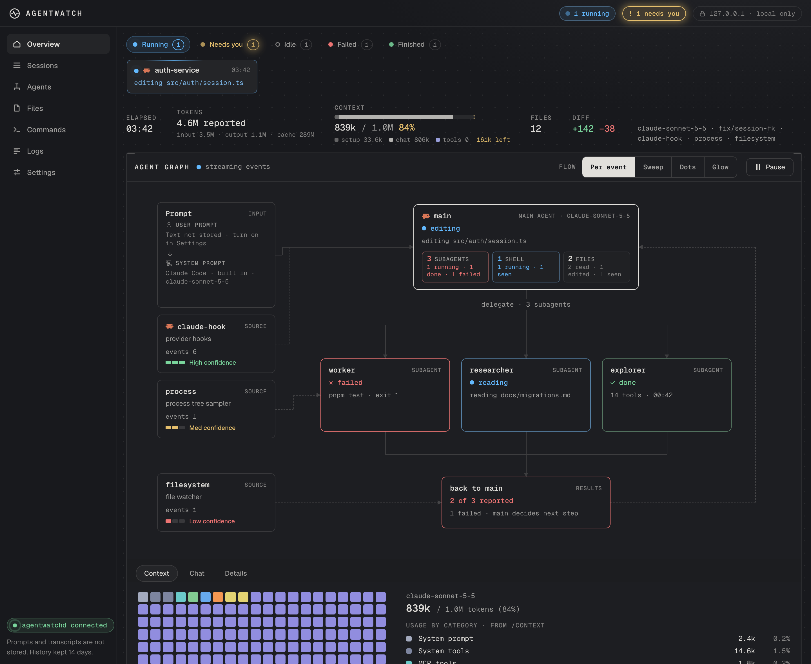
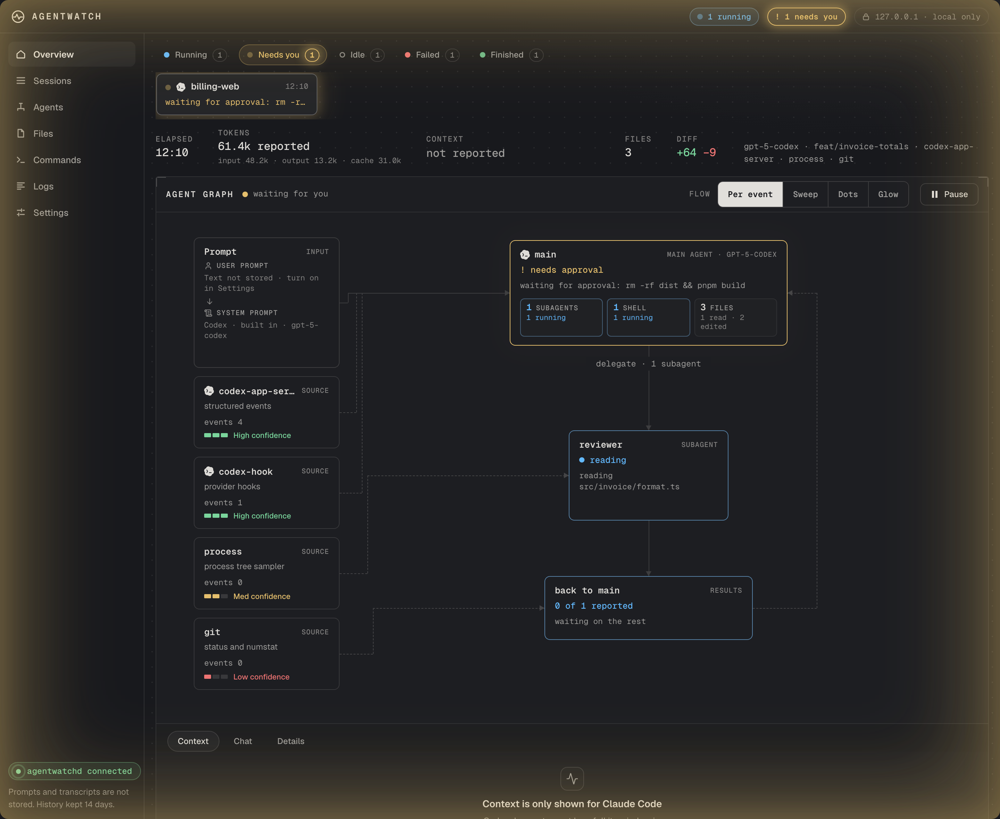
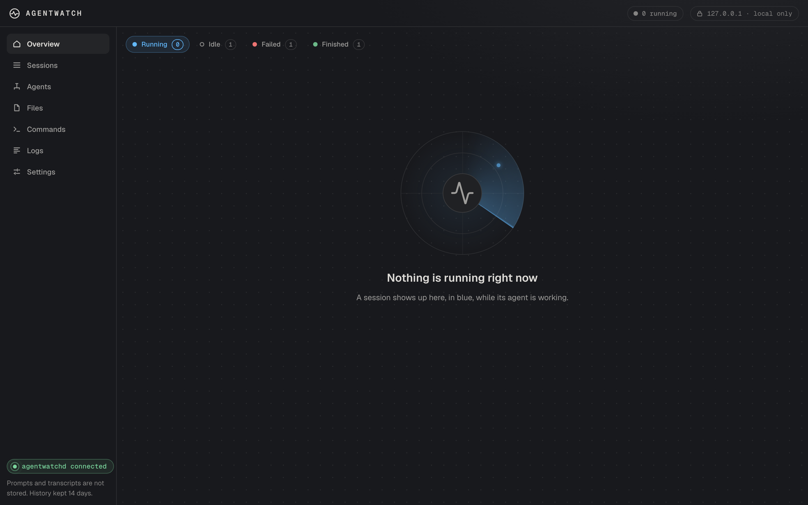
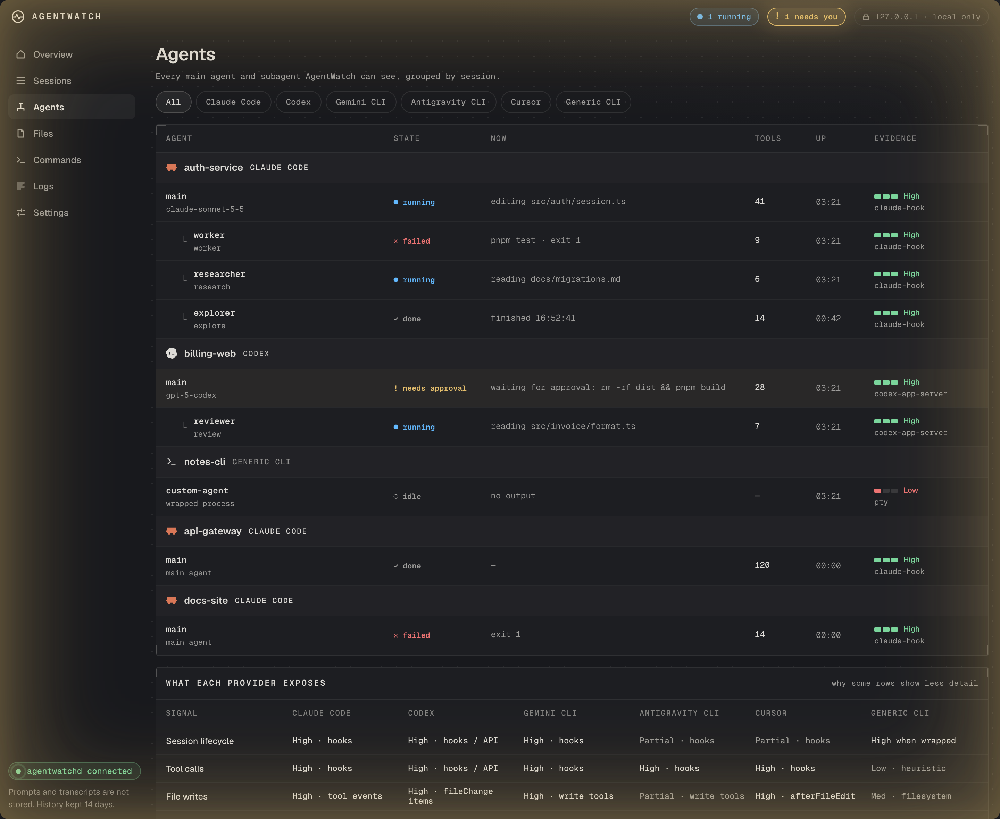
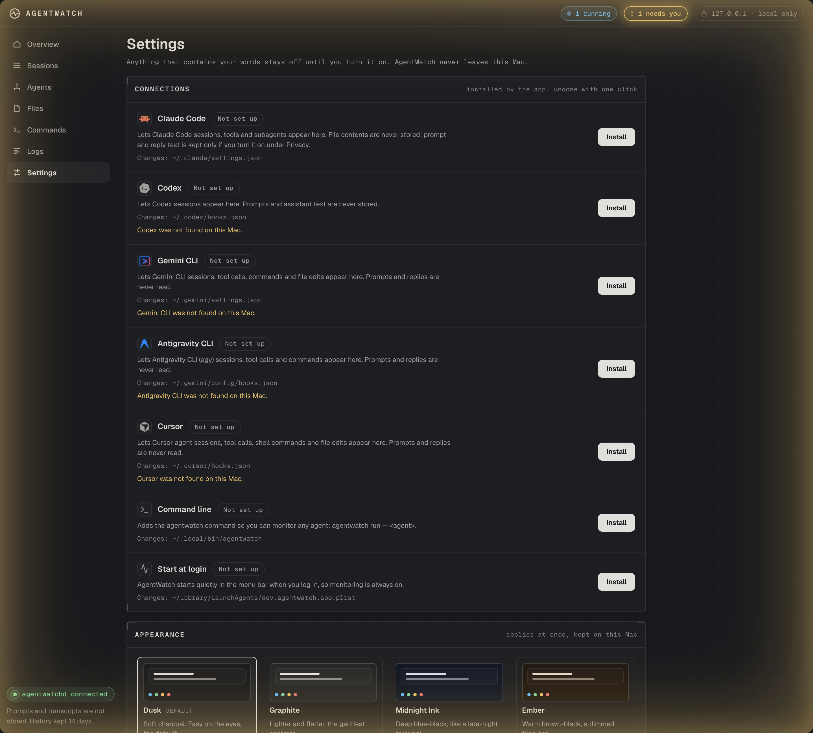

<div align="center">


# AgentWatch

**Mission control for the AI coding agents on your Mac.**<br/>
See what every agent is doing right now, what it just did, what changed, and the moment one of them needs you.


</div>

<p align="center"></p>

AgentWatch is a menu-bar app that watches **Claude Code, Codex, Gemini CLI, Antigravity CLI, Cursor** and any other CLI agent you
run under it. It is an observability layer, not a terminal scraper: the agents' own hooks are the ground truth, and a PTY wrapper,
a file watcher, Git and the process tree fill the gaps, always labelled as lower evidence. **Nothing leaves your machine.**

## Why you might want it

You start three agents, one spawns subagents, another is waiting on a permission prompt behind a window you forgot about.
AgentWatch puts all of it on one screen and tells you honestly how sure it is.

<table>
<tr>
<td width="50%"></td>
<td width="50%"></td>
</tr>
<tr>
<td><b>It asks for you, loudly.</b> When an agent needs an approval or has a question, a soft yellow light breathes around the
window frame, the badge pops, and the session moves to <i>Needs you</i>. Say no or press Esc in Claude Code and it clears.</td>
<td><b>It stays quiet when there is nothing to see.</b> The page opens on <i>Running</i>; with nothing running you get a
calm radar, not a stale session. A new session that starts running takes the page by itself.</td>
</tr>
</table>

- **Agent graph.** The prompt, the sources of evidence, the main agent, every subagent and shell, drawn live. Flow animates only
  on agents that are actually running; elapsed time freezes when a session goes idle.
- **Context window, like `/context`.** A grid of what fills the window (setup, conversation, tool results) and how much is
  left, with the real breakdown when you run `/context`.
- **Tokens and diff at a glance.** Fresh input, output and cache per session; additions and deletions in green and red.
- **Honest confidence.** Every event carries High / Medium / Low evidence. A provider hook is High; a file watcher is Low and
  is never blamed on an agent.
- **Sessions by status.** Running, Needs you, Idle, Failed, Finished: with readable names instead of worktree slugs.
- **Six themes.** A soft charcoal by default, and a true black if you want the original.

<p align="center"></p>

## One click to connect

<p align="center"></p>

Settings → Connections shows, for each agent, the exact file it will change. It is backed up first, your own hooks (and any other
tool's) are kept, and **Remove** puts the file back as it was.

| Agent | What AgentWatch sees | How sure |
|---|---|---|
| **Claude Code** | sessions, tools, commands, files, subagents, approvals, tokens, context | proven against a live run |
| **Codex** | sessions, tools, commands, files, subagents, approvals | built from docs; you must review its hooks once in Codex (`/hooks`) |
| **Gemini CLI** | sessions, turns, tools, commands, file edits | read from the installed CLI; not yet seen live |
| **Antigravity CLI** (`agy`) | sessions, turns, tools, commands, file writes | read from its bundled guide; not yet seen live |
| **Cursor** | sessions, tools, shell commands, file edits | built from Cursor's docs; not yet seen live |
| **Anything else** | `agentwatch run -- <agent>` wraps it: process, files, Git, terminal activity | Low / Medium |

The full, unvarnished list of what is proven and what is not is in [Status](#status).

## Private by construction

- **Local only.** The service binds to `127.0.0.1`; there is no analytics, no crash upload, and the app's content-security policy
  only allows loopback.
- **Your words stay off until you turn them on.** Prompt and reply text is never stored by default. A raw hook payload is reduced
  to metadata by the adapter, then an allow-list runs before anything is stored or streamed.
- **Secrets are scrubbed** from command lines and errors at the single choke point every event passes through.
- **Cheap to run.** About 53 MB idle in the menu bar, ~10 ms per hook call (a `curl`), nothing for the agent to wait on.

Details are under [Privacy, as enforced in code](#privacy-as-enforced-in-code).

## Get it running

```sh
git clone https://github.com/flukelaster/agentwatch.git
cd agentwatch
pnpm install
scripts/build-macos.sh            # builds the app and a .dmg into dist/ (Node 24, pnpm 10 and Rust needed)
open dist/*.dmg                   # drag AgentWatch to Applications, open it, press Set up
```

The build is **ad-hoc signed**, not notarised: macOS will warn on first launch (right-click → Open). To try the interface without
installing anything: `pnpm dev:ui` and open `http://127.0.0.1:5173/?mock=1`.

---

## Reference

The sections below are the working documentation. The original plan is in [`AgentWatch.md`](AgentWatch.md) and the approved design is in
[`design/artboards`](design/artboards).

## Using the app (nothing to run)

1. Open `AgentWatch.app`. It is a menu-bar app. On first launch it shows **Set up AgentWatch**.
2. Press **Set up**. One click does everything you left ticked, and tells you what it changed and where the backup is:
   - **Claude Code / Codex / Gemini CLI / Antigravity CLI / Cursor**: adds the AgentWatch hooks to `~/.claude/settings.json` / `~/.codex/hooks.json` / `~/.gemini/settings.json` / `~/.gemini/config/hooks.json` (as its own `agentwatch` group) / `~/.cursor/hooks.json` (your file is backed up first, your own hooks, and those of other tools, are kept).
   - **Command line**: puts `agentwatch` in `~/.local/bin`.
   - **Start at login**: AgentWatch starts quietly in the menu bar when you log in.
3. Start a **new** agent session. It appears in AgentWatch. (Sessions that were already open have no hooks.)

Keep `AgentWatch.app` in your Applications folder. If you move it, the command and the login item it installed are rewritten to
the new place the next time it starts. If it is running straight from a disk image or a fresh download (macOS runs those from a
temporary copy), it refuses to install the command and start-at-login and tells you to move it first.

Everything is reversible from **Settings → Connections** (Remove). If you skip setup, a banner on the Overview offers to connect any
agent it finds on your Mac. The app starts and owns its own background service: there is no terminal to keep open, and the service
exits by itself if the app goes away.

## Themes

Settings → Appearance. **Dusk** (default) is a soft charcoal; **Graphite**, **Midnight Ink**, **Ember** and **Nebula** are other dark moods; **Obsidian** is the original true black. Every grey in the interface is a token (`--g-XX`, the level it had in the black design) and a theme only says where black and white go, so a theme changes the whole interface, and the status colours (blue in progress, green done, amber needs you, red failed) are the same in all of them. The choice is kept on this Mac and applies at once in every open window. Text stays at WCAG 7:1 or better in every theme (a test checks it).

## What it costs

Measured on an Apple Silicon Mac with the release build (`node scripts/app-smoke.mjs`, `node scripts/bench.mjs`):

| | |
|---|---|
| App on disk | 121 MB (116 MB of it is the official Node 24 runtime it carries, so nothing has to be installed) |
| Idle, menu bar only (no window open) | **~53 MB** physical footprint (app 13 MB + service 40 MB), 0% CPU. Activity Monitor's "Memory" column; RSS reads higher because it counts shared pages of the Node binary |
| Service under 40 events/s | ~42 MB footprint, ~3% of one core |
| Hook cost per tool call | **~10-12 ms** (a `curl` call). The previous Node forwarder took ~35-40 ms and started a 100 MB process every time |
| Dashboard window | a WebView exists only while the window is open; the popover is dropped a minute after it is hidden |

What is done for that: the forwarder is the `curl` that ships with macOS (no Node per call); the graph's frame loop stops when nothing
is moving; a project directory is watched with one FSEvents handle (never one file descriptor per file) and only while a session needs it; the process sampler slows to every 10 s when no wrapped session is active;
session rows are written behind (400 ms) instead of on every event; the tray's numbers come from a small push stream, not a WebView.
The floor is Node itself: an empty Node 24 process is 42 MB RSS. Going below that means rewriting the service in Rust.

## Development

Requirements: macOS, Node 24+, pnpm 10, Rust (only for the app).

```sh
pnpm install
pnpm test                      # every package (416 tests); `cargo test` in apps/desktop/src-tauri adds 6
pnpm e2e                       # real daemon + real UI in headless Chrome, throwaway HOME; screenshots in .data/e2e-shots
pnpm daemon                    # run the service by hand (development only; the app starts its own)
pnpm demo                      # replay a synthetic scenario into it
pnpm dev:ui                    # http://127.0.0.1:5173  (add ?mock=1 to run without a service)
node scripts/readme-shots.mjs  # regenerate docs/images from the demo data (never from real sessions)

node scripts/prepare-runtime.mjs                 # downloads official Node 24 (checksum verified) + bundles the service, CLI, node-pty
cd apps/desktop && pnpm exec tauri build --bundles app
scripts/build-macos.sh [aarch64|x86_64]          # app + dmg into dist/, ad-hoc signed (APPLE_SIGNING_IDENTITY for a real one; PRETTY_DMG=1 for the styled Finder window)
node scripts/app-smoke.mjs                       # copies the .app elsewhere, empty HOME, proves the whole flow (see below)
node scripts/bench.mjs                           # latency, memory, CPU
```

Quit any hand-started `pnpm daemon` before opening the app: the app reuses a service that is already running, and an old one
does not have the hook endpoint.

`app-smoke.mjs` launches the copied app hidden (no window) with an empty HOME and checks: it starts its own service on its bundled
Node as a child process; Set up installs all four items and pressing it again changes nothing; a hook run from the installed
`settings.json` reaches the database; the installed `agentwatch` command and the PTY wrapper work; SIGTERM stops the service
cleanly; force-killing the app cannot leave an orphan service (it exits ~1-5 s later).

## Layout

```
apps/desktop           React 19 + Vite UI, and the Tauri 2 shell (src-tauri: tray, windows on demand, owns the service)
services/daemon        agentwatchd: single SQLite writer, normalizer, observers, WS + HTTP + UDS servers
packages/protocol      AgentEvent v1, WebSocket frames, privacy allow-list, redaction
packages/setup         install / status / revert of hooks, the command and start-at-login (used by the app and the CLI)
packages/adapter-sdk   adapter contract and helpers
packages/adapters/*    claude-code, codex, gemini-cli, antigravity, cursor, generic-cli
cli/agentwatch         `agentwatch` command: PTY wrapper, setup, demo
fixtures/              checked-in sanitized provider payloads (the adapters' contract tests)
design/artboards       the approved design, as .dc.html
scripts/               runtime prep, benchmarks, smoke and e2e checks, release scripts
```

## How events get in

```
agent hook ──> sh ~/Library/Application Support/AgentWatch/agentwatch-hook.sh ──curl──> 127.0.0.1:<port>/hook/<claude|codex|gemini|antigravity|cursor>
                                                                               (bearer secret from a 0600 file)
agentwatch run -- <agent> ──> PTY wrapper ──> Unix socket (0600, in a 0700 directory)
```

The service rewrites `agentwatch-hook.sh` on every start with its current port; `settings.json` only ever points at that stable
path, and holds no secret. The secret (`hook-headers`, 0600) lets a local process **inject** fake events, not read anything: the same
trust level as the Unix socket. A web page cannot post events (it cannot set the header without a CORS preflight, and none is ever answered).
The hook script always exits 0 and prints nothing, so it can never block or disturb an agent.

## Privacy, as enforced in code

- A raw hook payload can contain prompts and file contents. It exists only inside one function in the service: the adapter reduces it to
  metadata, then a per-kind **allow-list** runs before anything is stored or streamed (unknown keys are dropped). Tests post payloads
  carrying sentinel prompts, file bodies and credentials and assert they appear nowhere in SQLite, its WAL, or the diagnostics log.
- **Token usage is on by default** (Settings → Privacy → "Track token usage"). Hooks carry no token counts, so the service reads the numbers (fresh input, output, cache) of each reply from Claude Code's conversation file, once per reply, and keeps only those counts: no text is read into storage. Turn it off and the file is not opened for this. Subagents that write to their own files are not included. The same pass gives the **context window** meter: the total is Claude Code's own count (last prompt plus reply); how it splits into setup, conversation and tool traffic is an estimate, and the window size is a guess unless pinned in Settings or reported by `/context`, because Claude Code does not put it in the conversation file: once Claude Code has compacted on its own it is the smallest of 200k / 1M / 2M that holds the size it compacted at (it does so just below the window); before that it is at least 1M for models known to have it (Sonnet 5.5), otherwise the smallest of the three the context fits in below 90%. One oversized reply (a cache rewrite can report the same prefix twice) can still inflate the guess before the first compaction: pin the size in Settings. When you run `/context` in a session, Claude Code saves its own breakdown in the conversation file; the service reads those numbers (the real window size, each category, the auto-compact buffer) and the Context tab then shows them instead of the estimate, growing the messages figure by what was added since. A compaction makes the report stale and it is dropped.
- **Prompt and reply text is off by default.** Two switches in Settings → Privacy ("Store prompt text", "Store assistant responses") let you read the conversation in the Chat panel. Only then does the service read Claude Code's own conversation file (only files under `~/.claude/projects`, never a path a hook merely names), keep the text of the kinds you turned on in the local database, with credentials redacted and each message capped, and show it. The manager itself refuses a message of a kind that is switched off, and turning a switch off deletes what was kept of it. Codex conversations are not read.
- Edit/Write inputs become **line counts** inside the adapter. Tool errors keep only their first line. `UserPromptSubmit` is never subscribed.
- Command lines and errors go through credential **redaction** at the single choke point every producer passes through (`apply()`),
  including the file watcher and process sampler.
- The WebSocket binds to `127.0.0.1`, sends nothing before a **single-use, 60-second capability**, and rejects foreign browser origins.
- No analytics, no crash upload, fonts are bundled, the app's content-security policy only allows loopback.
- History defaults to 14 days; "Delete all local history" removes the database and its WAL/SHM files.

Confidence is carried on every event: a provider hook or API is **High**, the process tree is **Medium**, filesystem / Git / terminal
text is **Low**, and an adapter cannot claim more than its source supports. Observed changes are never attributed to an agent.

## Status

| Area | State |
|---|---|
| Protocol, privacy, redaction, daemon, SQLite | Implemented, tested with real sockets and files; the whole suite also passes on Node 24.21 |
| Claude Code adapter | Implemented against fixtures **and proven against a live Claude Code run** (isolated daemon, real `claude -p`: session, tool and command events arrived, none rejected) |
| Approvals turned down in Claude Code | Pressing Esc (or answering no) at a permission prompt runs **no hook**, so a hook-only monitor stayed yellow until the 15-minute expiry. The conversation file does record it (`[Request interrupted by user for tool use]` and a rejected tool result), so the reader that already follows it for token counts clears the question and marks the turn interrupted. It reads only those fixed phrases; it needs "Track token usage" (on by default) or a chat switch to be on, and it does not exist for Codex, Gemini CLI, Antigravity CLI or Cursor, which have no such file AgentWatch reads |
| Codex adapter (hooks, App Server, `exec --json`) | **Built from documentation. The hooks do not reach AgentWatch until you review them in Codex** (`/hooks`, once): Codex 0.157 refuses unreviewed hooks, and a live `codex exec` run confirmed zero events arrived without that review. Payload field names are therefore still unverified against real Codex traffic |
| Gemini CLI adapter (hooks) | Field names read from the installed Gemini CLI 0.49 (its hook input builders), tested against a fixture built from them, and installing was dry-run against a copy of a real `~/.gemini/settings.json` (another tool's hooks kept, revert exact). **Not yet seen with live Gemini traffic.** Gemini sends no tool-call id (start and end of a call are paired by tool + input), and has no subagent or permission-request hook, so those show nothing. No tokens or chat: AgentWatch does not read Gemini's conversation files |
| Antigravity CLI adapter (hooks, `agy`) | Field names and file format read from the hooks guide bundled in the installed agy 1.2.17, tested against a fixture built from it, and installing was dry-run against a copy of a real `~/.gemini/config/hooks.json` (another tool's group kept, revert exact). **Not yet seen with live agy traffic.** Only `PreInvocation`, `PostToolUse` and `Stop` are installed: agy reads the output of `PreToolUse` / `PostInvocation` as a decision, and hooks run synchronously, so the forwarder answers `{}` and never sits in a decision path. The payload does not name its event, so the three are told apart by the field each carries. A command's start is not seen before it runs (`PostToolUse` only), file reads are not mapped (argument name unconfirmed), and there are no subagents, tokens or chat |
| Cursor adapter (hooks) | **Built from Cursor's hooks documentation, not yet seen with a live Cursor.** Only hooks that report finished work are installed (`postToolUse`, `afterShellExecution`, `afterFileEdit`, `stop`, session start/end): Cursor reads the output of its "before" hooks as an allow/deny decision, so an observer is never put there. No subagents, exit codes, tokens or chat. Whether the `cursor-agent` command-line tool fires the same hooks as the editor is unverified |
| Generic CLI (PTY wrapper, fs / Git / process observers) | Implemented; real PTY, Git repo and `ps` exercised |
| Set up / Settings → Connections | Real installs with backups, idempotent, migrates the older Node-style hook entries; tested in throwaway homes |
| Packaged app | Apple Silicon and Intel `.app` + `.dmg` built (`dist/`, ad-hoc signed). The smoke test passes on both (Intel under Rosetta). Run from a disk image, it refuses to install the command / login item |
| Menu bar | Windows on demand, popover rendering and placement math tested. **A real click on the status item was never exercised** (on the test Mac a menu-bar manager pushed the item off-screen) |
| Release scripts (sign, notarize, pkg) | Written, syntax-checked, never run: they need an Apple Developer account. The Node sidecar needs the JIT entitlement, which the script grants |

Not done: notarized/signed distribution (the DMGs are ad-hoc signed: Gatekeeper will warn), proof of Codex, Gemini CLI, Antigravity CLI and Cursor hook payloads against live traffic, hook support for OpenCode (it takes a JS plugin, not a hooks file) and Crush (nothing to hook; use `agentwatch run -- crush`), a live Codex App Server session runner, a Rust rewrite of the service,
process attribution to a specific agent.
